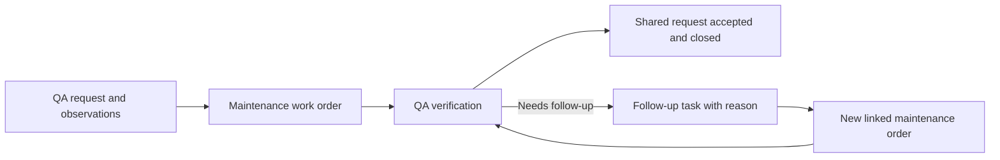

# QueSuite — shared work across departments

Status: product direction captured September 5, 2026. The workflow and implementation sequence below are proposed. They are not implemented capabilities.

The owner also requested broader operations ideas be preserved for consideration. [OPERATIONS-REGISTER.md](OPERATIONS-REGISTER.md) records those candidates with stable IDs and separate decision/delivery states. It extends this blueprint without changing the next planned increment or treating every captured idea as an approved feature.

## Confirmed direction

QueSuite remains a CMMS for maintenance work and will also coordinate related work across separate departments, beginning with QA, Maintenance, Accounting, Parts, and Logistics. Support both operational/shift notes and meter-reading history. Managers, supervisors, leads, and associates should be able to understand relevant progress, their own responsibilities, how to perform the work, and how that work contributes to the company. Guidance must be able to evolve with the company's processes.

The current app provides assets, locations, work orders, linked detail views, completion notes, and system audit records. It does not yet provide department memberships, shared requests, manual meters, operational logbooks, PM generation, or role-specific access.

## Proposed first walkthrough

Use one QA request that needs a Maintenance repair and QA verification. This is a working example pending the owner's choice of a representative handoff.

1. QA records an observed problem, relevant readings, and the expected outcome in a shared request.
2. A request owner coordinates a Maintenance task linked to an existing asset work order.
3. Maintenance follows the attached instructions, records work notes and before/after readings, and completes its work order through the existing review/closure process.
4. QA verifies the result against the shared request's acceptance criteria. Failed verification records the reason and prompts an explicit follow-up task; it does not silently reopen a closed maintenance record.
5. The authorized request owner closes the shared request after all required work and verification are accepted.

Follow-up creates another linked maintenance action when needed. Routine QA tasks can also exist without an asset; the existing maintenance work order continues requiring an asset.

## What each person can use

The owner expects associates to be frequent first contributors, including creating building/location, asset/equipment, department and part records and recording their sources. Contribution should be available through explicit permissions and should preserve credit at every role level. [CONTRIBUTIONS.md](CONTRIBUTIONS.md) defines the proposed source, authorship, explained revision, reversal and duplicate-consolidation behavior. Basic contributions do not require blanket approval based only on seniority; review and privileged actions have their own permissions.

Accounting is a peer department: it can originate a request, own tasks, request evidence from another department, and complete its own handoffs. It does not participate only as an approver. The same manager/supervisor/lead/associate perspectives apply within Accounting according to each person's responsibilities.

These are proposed default views, not fixed permission grants or a mandatory approval chain.

| Perspective            | Useful view                                                                                     | Guidance alongside the work                                                          |
| ---------------------- | ----------------------------------------------------------------------------------------------- | ------------------------------------------------------------------------------------ |
| Manager                | Outcomes, overdue work, blockers, and handoffs across authorized departments                    | Why the work matters and which decisions need attention                              |
| Supervisor             | Department queue, priorities, assignments, and authorized reviews                               | Responsibilities, acceptance criteria, and escalation paths                          |
| Lead                   | Work readiness, prerequisites, coordination, and support needs                                  | Relevant procedure revisions and handoff expectations                                |
| Associate / technician | Assigned work, source-backed record creation and contributions, relevant context and next steps | Instructions, required readings, expected results, sources, and when to ask for help |

Everyone should have the context required to do their work. A concise default view must not remove access that their responsibilities legitimately require. Job title, department membership, assigned responsibility, and permission to view/edit/approve are separate concepts. A person may participate in multiple departments. Reporting relationships must not automatically grant access to every underlying log or approval.

Authorized owners/investors may also review or contribute within their granted scope. Preserve creator, contributor, source provider, reviewer and responsible owner as separate identities. Updating, reviewing or reversing a contribution does not transfer its authorship to the person making that later decision.

## Accounting in the proposed pilot

Keep the first QA–Maintenance example and add one Accounting task when the chosen scenario needs it. Possible handoffs include a cost estimate review before a purchase commitment, a cost/documentation review after work, or a request from Accounting for Maintenance to verify an asset or explain a recurring repair expense. Purchasing execution and financial-system updates remain separate future scope.

For example: QA reports inconsistent output; Maintenance identifies a replacement part; an authorized Accounting participant reviews the cost evidence if the request requires that decision; Maintenance performs the repair; QA verifies the result; Accounting receives the completion and cost references needed for its own follow-up. Tasks may run in parallel where no prerequisite is defined. There is no default requirement for Accounting to approve every repair or QA task.

Show Maintenance execution, QA acceptance, and Accounting review as distinct task results. A record can show "repair completed / QA accepted / cost documentation pending" without misrepresenting any of those outcomes. The shared request's required tasks determine closure; payment status must not silently change work-order status or become a default closure requirement.

The first Accounting task should capture only the evidence the agreed workflow needs, such as an estimate or actual amount with currency, a cost-category reference, and a document/reference identifier. Label submitted values as estimates or reported costs until reviewed. Record the authorized reviewer's decision and its scope separately from task completion. References to a purchase order or invoice do not imply that QueSuite created, posted, or paid it.

Shared progress can expose the responsible department, next action, and review outcome while detailed financial evidence follows explicit access rules. Follow the same revisioned instructions and audit trail as other departments. Bookkeeping, tax handling, payments, and ERP synchronization are not part of this planned coordination increment.

## Parts and Logistics in the proposed model

The owner explicitly added Parts and Logistics as participating departments, and requested parts associated with assets/equipment, rooms, areas, and departments. Both departments can originate requests, own tasks, manage handoffs, and use the same role guidance as other departments. Proposed responsibilities: Parts manages catalog/stock readiness and reservations; Logistics coordinates transfers, delivery, custody and receipt. Exact authority will follow the company's chosen workflow and permissions.

Use one company-scoped part catalog and link it to the places and work it supports. A reusable item such as a filter should not need a separate catalog entry for each machine or department.

| Relationship                   | What it means                                                                                                                     | Example                                                                     |
| ------------------------------ | --------------------------------------------------------------------------------------------------------------------------------- | --------------------------------------------------------------------------- |
| Fits / approved for            | The item is specified for an asset/equipment model or a particular asset; record the source/revision supporting that association  | Filter F-100 is specified for Pumps A and B                                 |
| Installed / used               | A dated installation or consumption record links the item, quantity and relevant work; serial/lot details can follow where needed | One filter installed on Pump A under its work order                         |
| Supports a room or area        | A location's relevant parts/consumables list, distinct from physical stock or an asset-specific specification                     | Lamps and filters used to maintain Utility Room 1                           |
| Stocked at                     | Actual stock in a physical location/bin, with quantity, unit and condition                                                        | Six filters in the Maintenance storeroom, two in the QA room                |
| Managed / used by a department | Organizational responsibility or usage; the same item can support several departments                                             | Parts manages replenishment while QA and Maintenance use the item           |
| Reserved / issued / returned   | Material committed to or transacted against a request, task or work order                                                         | One filter reserved for Pump A, then issued or returned                     |
| Transferred / delivered        | Origin, destination, dispatched quantity, custody, receiving acknowledgment and discrepancies                                     | Logistics moves the reserved filter to the line and records who received it |

Rooms and areas are physical locations; departments are organizational records. The current location hierarchy is site → building → work area, so a room can be represented by a named work area in the current pilot. Any richer room/area taxonomy needs a later explicit model change. A part associated with a room is not automatically stocked there, and a department association does not add stock. Derive quantities from stock transactions. Compatibility, installation, reservation, delivery and use remain distinct facts. Item receipt may still require a separate QA check where that workflow calls for it.

Proposed navigation: asset/equipment → relevant parts; room/area → supported parts and physical stock; department → managed/used parts; part → where used, where stocked, pending work and delivery history. Keep each relationship labeled so the user knows what a displayed quantity or link represents. A serialized component may also have an asset record; link that instance to its catalog item when needed.

Example handoff: Maintenance requests a filter → Parts checks availability and reserves it → Logistics transfers it and confirms receipt → Maintenance records installation against the work order → QA verifies when required → Accounting receives the relevant reported-cost evidence. Each department's task result stays separate, and no department becomes a universal approval gate.

### Later links, pricing and sourcing

The owner proposed product links, price and sourcing for later consideration. Preserve these as supplier offers/reference records linked to the catalog item: manufacturer and supplier part numbers, product/specification URL, supplier, quote/source reference, price, currency, purchasing unit/pack quantity, effective/checked date, lead time and availability evidence. Multiple suppliers can offer one part. Any proposed substitute needs its own applicability/approval evidence.

A current catalog offer must not overwrite historical quoted, approved or reported transaction costs. A saved product URL or quoted price does not establish current availability. Purchasing/payment execution and automatic price retrieval remain separate scope. First define the catalog and its relationships, then add stock/logistics transactions and later sourcing information as selected increments.

These are planned requirements, not new app capabilities. The manual meters/logs increment remains next; use OPS-005 and OPS-006 in the [operations register](OPERATIONS-REGISTER.md) to retain the parts/logistics scope without duplicating catalog or task systems.

## Small domain additions

| Record                    | Purpose and links                                                                                                                                              |
| ------------------------- | -------------------------------------------------------------------------------------------------------------------------------------------------------------- |
| Department and membership | Company-scoped department membership including QA, Maintenance, Accounting, Parts, and Logistics, responsibilities, and action permissions                     |
| Shared request            | Desired outcome, requester, accountable owner, participating departments, optional asset/location, acceptance criteria, and overall progress                   |
| Department task           | One owning department, assigned person, expected result, instruction revision, and an explicit prerequisite or handoff; may reference a maintenance work order |
| Instruction revision      | Purpose, steps, required evidence, expected outcome, escalation guidance, author/reviewer, and effective revision                                              |
| Meter and reading         | Asset, meter kind, unit, value, observation time, recording time, author/source, and links to the work that collected the reading                              |
| Operational log entry     | Shift note, observation, or handoff with author, timestamps, and explicit asset/request/task/work-order references                                             |
| Acceptance record         | Authorized reviewer, criteria/result, time, and reason for acceptance or required follow-up                                                                    |

Every business record and relationship remains company-scoped. Department collaboration takes place within that company boundary. Access to a shared summary does not automatically expose every department's underlying note. Route handlers and repositories must enforce membership and action permissions before independent team access; client filters and role selectors cannot provide that enforcement.

## Execution, evidence, and learning

For a task backed by a work order, derive execution progress from that work order instead of maintaining a second independently editable completion status. Keep any requesting-department acceptance explicit. Completing a repair does not automatically certify that QA's expected outcome was achieved.

Store a meter reading once, then link it from the asset history, logbook, and relevant work. Operational notes are authored content; audit events record system changes. Corrections preserve the original entry, link the replacement, and record who corrected it and why. Reading observation time and recording time are separate so later offline entry remains possible. An assignee label is not evidence of authorship; the current pilot-owner identity must remain clearly identified until authenticated memberships exist.

Separate cumulative meters (hours, cycles, mileage) from condition readings (temperature, pressure). Cumulative counters need explicit reset, rollover, and replacement handling. Values, units, and source must be established before calculations or PM triggers rely on them. Requests and work orders can reference the particular readings used at that time so newer readings cannot silently replace their evidence.

Start role guidance with four questions beside the task: Why does this matter? What do I own? What result does the next person need? When should I ask for help? Procedures can include a short explanation as well as the steps. Tasks retain the instruction revision used. A new revision should show what changed and require an explicit decision before it replaces instructions for active work. Acknowledging a revision or completing a task does not by itself establish competency or certification.

PM plans can later specify a time or usage interval, required readings, and procedure revision. Each generated work order records the rule and reading that caused it. Generation must avoid duplicate work when readings or scheduler runs are retried. A PM can create a standalone maintenance order or contribute a maintenance task to a shared request. PM completion must follow the same department acceptance rules when other teams are involved.

## Baby-step implementation sequence

1. Add manual asset meters and linked operational notes. Validate units, timestamps, corrections, retries, and links from asset/work-order details in the owner-led pilot.
2. Prove the single shared-request → Maintenance → QA-verification example, adding one Accounting-owned review or documentation task when applicable. Also allow Accounting to originate a request. Design its API contract and additive schema before code; preserve the existing maintenance lifecycle.
3. Add a concise, revisioned instruction and role-guidance view for that example. Avoid a general workflow designer or a full learning-management platform.
4. Implement authenticated company/department memberships and server-enforced permissions before separate people operate the departmental workflow. Validate permitted and denied cross-department actions as well as cross-company isolation.
5. Extend the established offline plan to readings, logs, and handoffs, including correction and concurrent-edit cases. Test devices and recovery before field reliance.
6. Add one PM rule using the proven meter history, with explicit scheduling/acceptance rules and duplicate-generation tests.

Owner-led examples can be reviewed before steps 4–5; independent departmental access and disconnected field use require those gates. The immediate product increment is the manual meters/logs foundation, not the full sequence at once.

## Evidence to collect in the walkthrough

Can QA see that Maintenance owns the next action? Can a technician find the correct instruction and record the relevant measurement? Can QA see the evidence needed to verify the result? Can a supervisor identify a blocked handoff? Can an associate explain their expected output and who needs it next? Record friction and missing context before deciding what to build next.

Can Accounting request missing evidence, identify which costs need review, and understand the completion handoff without exposing restricted financial details to everyone? Can the team distinguish a finished repair, accepted QA result, and outstanding Accounting task?
