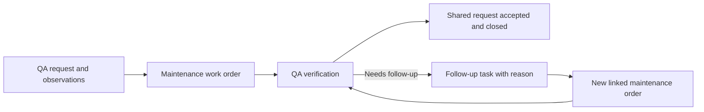

# QueSuite — shared work across departments

Status: product direction captured September 5, 2026. The workflow and implementation sequence below are proposed. They are not implemented capabilities.

## Confirmed direction

QueSuite remains a CMMS for maintenance work and will also coordinate related work across separate departments, beginning with QA and Maintenance. Support both operational/shift notes and meter-reading history. Managers, supervisors, leads, and associates should be able to understand relevant progress, their own responsibilities, how to perform the work, and how that work contributes to the company. Guidance must be able to evolve with the company's processes.

The current app provides assets, locations, work orders, linked detail views, completion notes, and system audit records. It does not yet provide department memberships, shared requests, manual meters, operational logbooks, PM generation, or role-specific access.

## Proposed first walkthrough

Use one QA request that needs a Maintenance repair and QA verification. This is a working example pending the owner's choice of a representative handoff.

1. QA records an observed problem, relevant readings, and the expected outcome in a shared request.
2. A request owner coordinates a Maintenance task linked to an existing asset work order.
3. Maintenance follows the attached instructions, records work notes and before/after readings, and completes its work order through the existing review/closure process.
4. QA verifies the result against the shared request's acceptance criteria. Failed verification records the reason and prompts an explicit follow-up task; it does not silently reopen a closed maintenance record.
5. The authorized request owner closes the shared request after all required work and verification are accepted.

Follow-up creates another linked maintenance action when needed. Routine QA tasks can also exist without an asset; the existing maintenance work order continues requiring an asset.

## What each person can use

These are proposed default views, not fixed permission grants or a mandatory approval chain.

| Perspective            | Useful view                                                                  | Guidance alongside the work                                                 |
| ---------------------- | ---------------------------------------------------------------------------- | --------------------------------------------------------------------------- |
| Manager                | Outcomes, overdue work, blockers, and handoffs across authorized departments | Why the work matters and which decisions need attention                     |
| Supervisor             | Department queue, priorities, assignments, and authorized reviews            | Responsibilities, acceptance criteria, and escalation paths                 |
| Lead                   | Work readiness, prerequisites, coordination, and support needs               | Relevant procedure revisions and handoff expectations                       |
| Associate / technician | Assigned tasks, the context needed to perform them, and next steps           | Instructions, required readings, expected results, and when to ask for help |

Everyone should have the context required to do their work. A concise default view must not remove access that their responsibilities legitimately require. Job title, department membership, assigned responsibility, and permission to view/edit/approve are separate concepts. A person may participate in multiple departments. Reporting relationships must not automatically grant access to every underlying log or approval.

## Small domain additions

| Record                    | Purpose and links                                                                                                                                              |
| ------------------------- | -------------------------------------------------------------------------------------------------------------------------------------------------------------- |
| Department and membership | Company-scoped QA/Maintenance membership, responsibilities, and action permissions                                                                             |
| Shared request            | Desired outcome, requester, accountable owner, participating departments, optional asset/location, acceptance criteria, and overall progress                   |
| Department task           | One owning department, assigned person, expected result, instruction revision, and an explicit prerequisite or handoff; may reference a maintenance work order |
| Instruction revision      | Purpose, steps, required evidence, expected outcome, escalation guidance, author/reviewer, and effective revision                                              |
| Meter and reading         | Asset, meter kind, unit, value, observation time, recording time, author/source, and links to the work that collected the reading                              |
| Operational log entry     | Shift note, observation, or handoff with author, timestamps, and explicit asset/request/task/work-order references                                             |
| Acceptance record         | Authorized reviewer, criteria/result, time, and reason for acceptance or required follow-up                                                                    |

Every business record and relationship remains company-scoped. Department collaboration takes place within that company boundary. Access to a shared summary does not automatically expose every department's underlying note. Route handlers and repositories must enforce membership and action permissions before independent team access; client filters and role selectors cannot provide that enforcement.

## Execution, evidence, and learning

For a task backed by a work order, derive execution progress from that work order instead of maintaining a second independently editable completion status. Keep any requesting-department acceptance explicit. Completing a repair does not automatically certify that QA's expected outcome was achieved.

Store a meter reading once, then link it from the asset history, logbook, and relevant work. Operational notes are authored content; audit events record system changes. Corrections preserve the original entry, link the replacement, and record who corrected it and why. Reading observation time and recording time are separate so later offline entry remains possible. An assignee label is not evidence of authorship; the current pilot-owner identity must remain clearly identified until authenticated memberships exist.

Separate cumulative meters (hours, cycles, mileage) from condition readings (temperature, pressure). Cumulative counters need explicit reset, rollover, and replacement handling. Values, units, and source must be established before calculations or PM triggers rely on them. Requests and work orders can reference the particular readings used at that time so newer readings cannot silently replace their evidence.

Start role guidance with four questions beside the task: Why does this matter? What do I own? What result does the next person need? When should I ask for help? Procedures can include a short explanation as well as the steps. Tasks retain the instruction revision used. A new revision should show what changed and require an explicit decision before it replaces instructions for active work. Acknowledging a revision or completing a task does not by itself establish competency or certification.

PM plans can later specify a time or usage interval, required readings, and procedure revision. Each generated work order records the rule and reading that caused it. Generation must avoid duplicate work when readings or scheduler runs are retried. A PM can create a standalone maintenance order or contribute a maintenance task to a shared request. PM completion must follow the same department acceptance rules when other teams are involved.

## Baby-step implementation sequence

1. Add manual asset meters and linked operational notes. Validate units, timestamps, corrections, retries, and links from asset/work-order details in the owner-led pilot.
2. Prove the single shared-request → Maintenance → QA-verification example. Design its API contract and additive schema before code; preserve the existing maintenance lifecycle.
3. Add a concise, revisioned instruction and role-guidance view for that example. Avoid a general workflow designer or a full learning-management platform.
4. Implement authenticated company/department memberships and server-enforced permissions before separate people operate the departmental workflow. Validate permitted and denied cross-department actions as well as cross-company isolation.
5. Extend the established offline plan to readings, logs, and handoffs, including correction and concurrent-edit cases. Test devices and recovery before field reliance.
6. Add one PM rule using the proven meter history, with explicit scheduling/acceptance rules and duplicate-generation tests.

Owner-led examples can be reviewed before steps 4–5; independent departmental access and disconnected field use require those gates. The immediate product increment is the manual meters/logs foundation, not the full sequence at once.

## Evidence to collect in the walkthrough

Can QA see that Maintenance owns the next action? Can a technician find the correct instruction and record the relevant measurement? Can QA see the evidence needed to verify the result? Can a supervisor identify a blocked handoff? Can an associate explain their expected output and who needs it next? Record friction and missing context before deciding what to build next.
